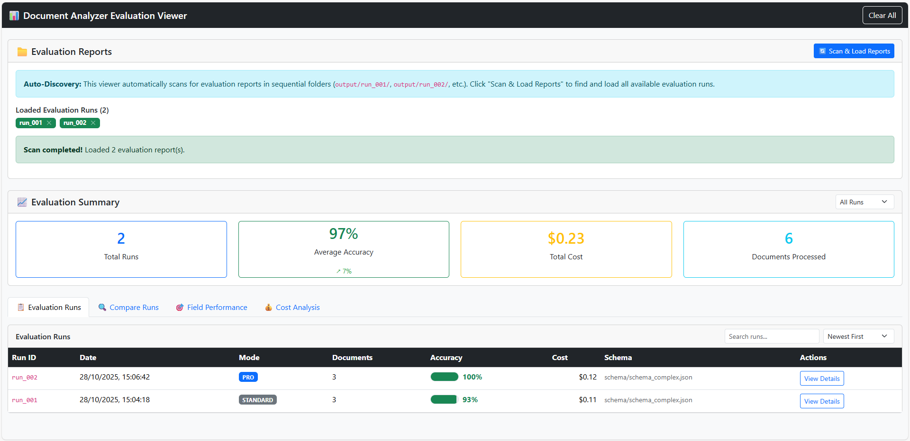
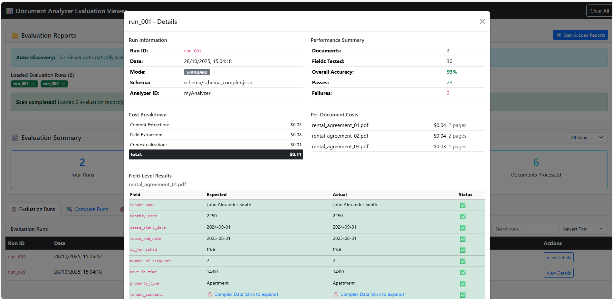
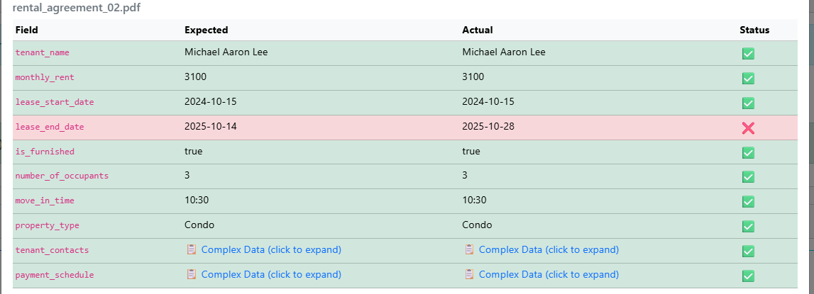
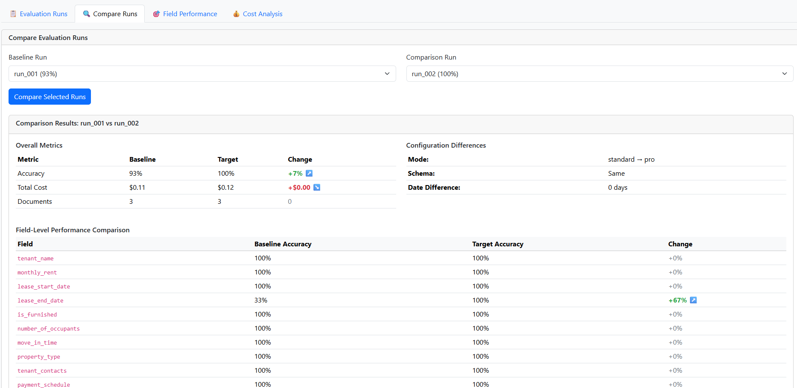
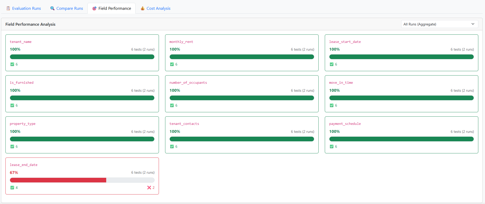
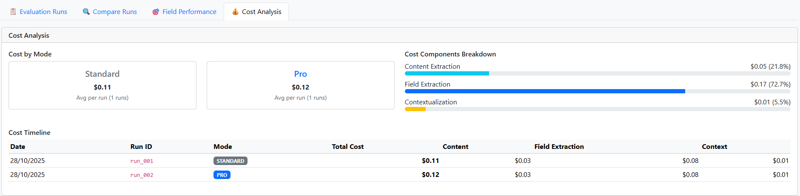

# 📊 Azure AI Content Understanding: Evaluation Toolkit
  
This project provides an evaluation harness for **Azure AI Content Understanding**, enabling automated **batch testing**, **accuracy evaluation**, and **cost analysis** for document analyzers. It helps measure how well Azure AI converts **unstructured documents** into **structured data** based on a target schema, compare results against expected test data, and visualize performance across multiple runs.
  
## 🚀 Overview  
  
The **Document Analyzer Evaluator** automates the end-to-end workflow for testing and tuning Azure AI Content Understanding analyzers.    
You can use it to:  
- Analyze multiple documents in batch.  
- Evaluate extraction accuracy against test datasets.  
- Estimate Standard vs. Pro mode costs.  
- Generate detailed reports and dashboards.  
   
## 🌟 Key Features  
  
- 📄 **Batch document analysis**    
  Process multiple documents (PDF, DOCX, TXT, PNG, JPG, etc.) in one run using Azure AI Content Understanding.  
  
- 🧩 **Schema-driven extraction**    
  Define your **target schema** (fields, types, extraction methods, etc.) in a JSON file of your choice.
  The schema file path is specified in `.env` using the `SCHEMA_FILE` variable.
  
- 📊 **Evaluation engine (optional)**    
  If expected test data is provided, the evaluator compares extracted fields to ground truth and computes field-level and overall accuracy metrics.  
  
- 💰 **Cost analysis**    
  Automatically calculates per-document and aggregate costs based on token and page usage for **Standard** or **Pro** mode.  
  
- 📈 **Reporting**    
  Produces both **JSON** and **Markdown** reports per run, summarizing accuracy, cost, and configuration details.    
  Reports are stored in sequential folders: `output/run_001/`, `output/run_002/`, etc.  
  
- 🌐 **Interactive viewer**    
  Use `evaluation_viewer.html` to explore historical runs, visualize accuracy trends, compare Standard vs. Pro mode, and analyze cost efficiency.  
  
 ## 🧩 Project Structure  
  
```  
.  
├── document_analyzer_evaluator.py     # Main Python script for evaluation workflow  
├── evaluation_viewer.html             # Interactive dashboard for viewing results  
├── requirements.txt                   # Python dependencies  
├── .env                               # Environment configuration (you create this)  
├── input/                             # Folder for input documents to analyze  
├── test_data/                         # Folder for expected test data (JSON)  
└── output/                            # Evaluation results and reports  
```  
  
## 🌍 Supported Regions  
  
Azure AI Content Understanding is currently available in **preview** and supports the following regions for resource creation and API usage:  
  
| Region Name | Region Identifier | Notes |  
|--------------|------------------|--------|  
| **West US** | `westus` | Recommended for North American users |  
| **Sweden Central** | `swedencentral` | Recommended for EU users (data stored within the European Union) |  
| **Australia East** | `australiaeast` | Recommended for Asia-Pacific users |  
  
## ⚙️ Setup  
  
### 1. Prerequisites  
  
- Python 3.8 or newer    
- Access to an **Azure AI Foundry** resource with **Content Understanding** enabled    
- REST API key and endpoint from your Azure portal  
  
### 2. Install dependencies  
  
```bash  
pip install -r requirements.txt  
```  
  
### 3. Configure environment  
  
Create a `.env` file in the project root:  
  
```bash  
ENDPOINT=https://<YOUR-ENDPOINT>.cognitiveservices.azure.com/  
API_KEY=<YOUR-API-KEY>  
API_VERSION=2025-05-01-preview  
ANALYZER_ID=myAnalyzer  
MODE=standard          # or "pro"  
INPUT_FOLDER=input  
TEST_DATA_FOLDER=test_data  
OUTPUT_FOLDER=output  
SCHEMA_FILE=schema/invoice_schema.json   # Example path; can be anywhere
```  
  
### 4. Prepare data  
  
- Place your **input documents** in the `input/` folder.    
- Define your **target schema** in a JSON file (e.g., `schema/invoice_schema.json`) — this describes the structure and fields you want the analyzer to extract.  
- Optionally, create **test data JSON files** in the `test_data/` folder with expected values for evaluation.    
  Each test JSON file should have the same name as its corresponding input document (e.g., `invoice_01.pdf` → `invoice_01.json`).  
  
```json  
{  
  "VendorName": "Contoso Ltd.",  
  "InvoiceDate": "2025-05-01",  
  "TotalAmount": 599.00  
}  
```  
  
If no test data is provided, the evaluator will perform **extraction only** (no accuracy comparison).  

## ▶️ Run Evaluation  
  
```bash  
python document_analyzer_evaluator.py  
```  
  
The script will:  
  
1. Validate the environment and folders.  
2. Delete any existing analyzer with the same ID.  
3. Create a new analyzer using your schema.  
4. Analyze all documents in the input folder.  
5. Compare extracted results to test data (if available).  
6. Calculate total and per-document costs.  
7. Generate markdown and JSON reports in `output/run_###/`.  
  
### 🧾 Sample Data Included  
  
This repository includes **synthetic sample data** to help you get started quickly:  
  
| Folder | Contents | Description |  
|---------|-----------|-------------|  
| `input/` | `rental_agreement_01.pdf`, `rental_agreement_02.pdf`, `rental_agreement_03.pdf` | Example rental agreement documents used for testing extraction |  
| `schema/` | `schema_simple.json`, `schema_complex.json` | Two example target schemas for rental agreements — a simple version (basic fields) and a complex version (nested or structured fields) |  
| `test_data/` | `rental_agreement_01.json`, `rental_agreement_02.json`, `rental_agreement_03.json` | Expected field values for each sample document, used by the evaluator to measure extraction accuracy |  
  
These examples are **synthetic and non-sensitive**, designed solely for demonstration and testing purposes.    
You can run evaluations immediately using these files, or replace them with your own documents and schemas.
  
## 📊 View Results  
  
After the evaluation completes, open the interactive viewer:  
  
```bash  
python -m http.server 8000  
```  
  
Then visit:    
👉 [http://localhost:8000/evaluation_viewer.html](http://localhost:8000/evaluation_viewer.html)  
  
You’ll see:  
- Evaluation summary across all runs  
- Field-level performance analysis  
- Cost breakdowns  
- Run comparisons  

## 🖼️ Screenshots  
  
### 🏠 Home Dashboard  
The home view automatically scans sequential output folders (`run_001`, `run_002`, etc.) and loads all evaluation reports. It summarizes the total runs, average accuracy, total cost, and documents processed, giving a quick overview of analyzer performance history.  
  
  
  
---  
  
### 📋 Run-Level Details  
Each run has an expandable detailed view showing configuration info, cost breakdowns, per-document metrics, and field-level comparisons. You can inspect which fields passed or failed, see per-document costs, and understand how extraction components contribute to total cost.  
  
  
  
---  
  
### 🔍 Field-Level Differences  
Within a run, you can compare **expected vs. actual** field values side-by-side. Mismatched fields are highlighted in red, making it easy to spot extraction inaccuracies.  
  
  
  
---  
  
### ⚖️ Compare Runs  
The **Compare Runs** tab enables direct comparison between two evaluation runs (e.g. Standard vs. Pro mode). It displays changes in accuracy, cost, configuration, and field-level performance improvements or regressions.  
  
  
  
---  
  
### 📈 Field Performance  
This view aggregates field accuracy across all runs, showing strengths and weaknesses at a glance. Each field card displays overall accuracy, number of tests, and a progress bar, great for identifying fields that need schema or extraction tuning.  
  
  
  
---  
  
### 💰 Cost Analysis  
The cost analysis tab visualizes how much each analyzer mode costs, broken down by component (content extraction, field extraction, contextualization). It also includes a timeline to track cost changes across runs, helping estimate efficiency and scalability.  
  


## 🧪 Tips  
  
- To test **Pro mode**, set `MODE=pro` in your `.env`.  
- You can safely re-run evaluations; new runs are stored as `run_001`, `run_002`, etc.  
- To compare two runs visually, use the **Compare Runs** tab in the viewer.  
  
## 📘 References  
  
- [Azure AI Content Understanding documentation](https://learn.microsoft.com/en-gb/azure/ai-services/content-understanding/overview)  
- [REST API Reference](https://learn.microsoft.com/en-us/rest/api/contentunderstanding/content-analyzers?view=rest-contentunderstanding-2025-05-01-preview)